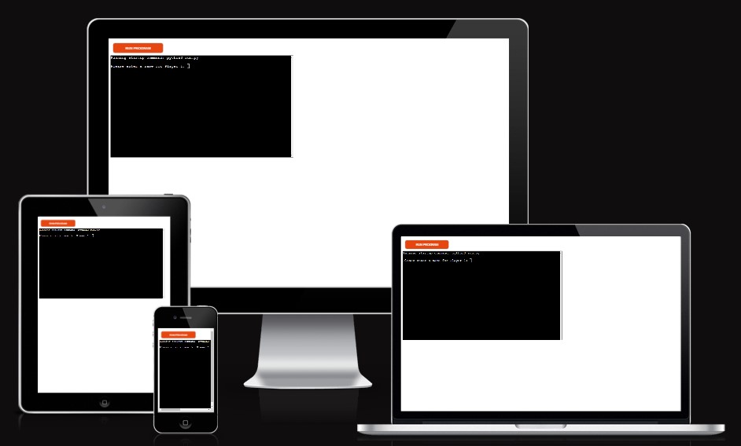
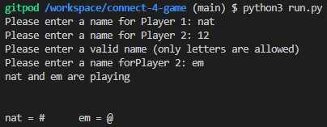
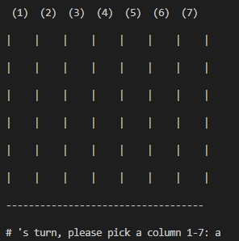
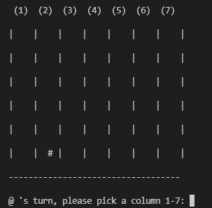
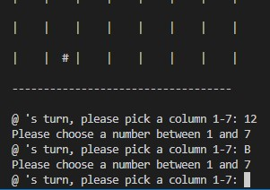
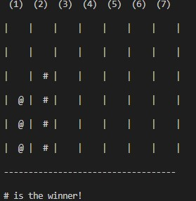
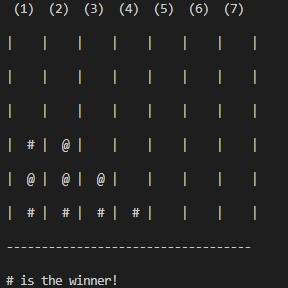
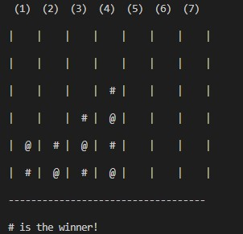
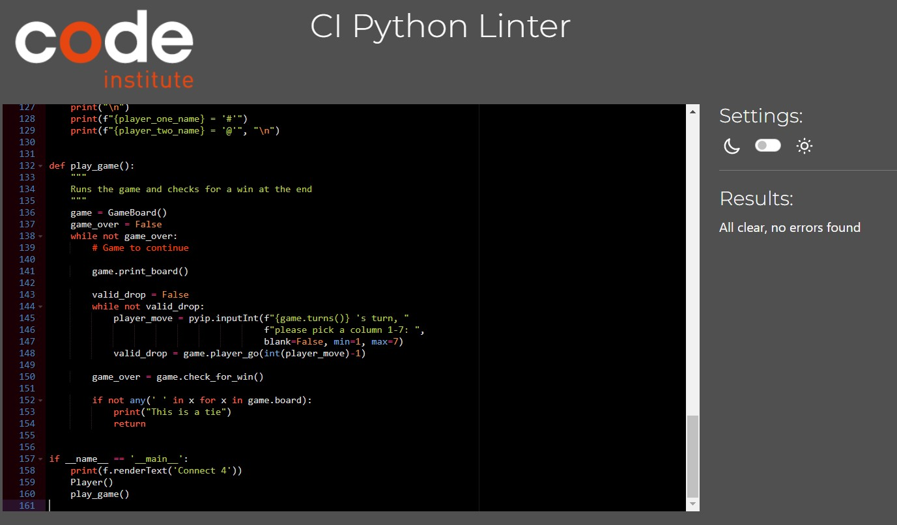

# Connect 4 Python Terminal Game

Connect 4 is a terminal based game ran through the mock terminal on Heroku.

This game is based off the popular board game 'Connect 4'. This a 2 player game, the aim of the game is to get 4 of your coloured tokens in a row , be it vertically, horizontally or diagonally.

## How To Play

This game is based on the origial game - Connect 4, you can read more about it here on [Wikipedia](https://en.wikipedia.org/wiki/Connect_Four).

To play this game:

1. Enter your name at the given prompt
2. Get your opponent to add their name at the 2nd prompt
3. You will be allocated a token piece which will be what appears when drop a token in your selected a column
4. Both players insert pieces until there is either 4 in a row or there is a tie
5. Once the winner/ no winner has been decided, you will be prompted if you want to play again

## Features

### Existing Features

* Asks for user to input their name and allocates a token
* Generates an error if numbers are entered (you can add a number after the name if 2 people of the same name are playing, so it will accept nat2 for example)

* Prints out the game board at the start of a players turn

* Prints the new game board when a token has been added

 

* It will print an error if a number out of the grid is entered or a letter is entered

* Detects 4 in a row in all directions

### Future Features

* Allow the user to choose their token, including different colours
* Have an AI player instead of the need for 2 human players
* Implement a scoreboard system

## Data Model

I decided to use a gameboard class and a player class as my model for this project. The game creates the board and will store the players move in the relevant position.

The gameboard class holds the way the game board looks (rows/columns) and creates the spacing between the different columns. This class also holds the user tokens, the players turns and the game tokens in play on the game board. This class prints the game board to the console at each turn. The other feature of this class holds the method that the game uses to determine the winner. It also contains methods that catch various errors such as invalid moves to outside the game board.

## Testing

* I ran the code through the Code Institutes code linter and it passed all the tests

* Warnings are produced when incorrect data is passed through user input
* Tested in Heroku and Gitpod terminal

## Bugs
### Resolved Bugs

* I had an issue with the game not replaying more than once when the first round was complete. This was due to the location of the code that asked the user if they wanted to play again, it was in the wrong function. Once I amended this, this worked correctly.
* I also found an issue with user input. This was where the player could input '0' or a negative number for their turn and their token would still be placed in the game board. I downloaded a library 'pyinputplus' which enabled the implementation of regular expressions to validate user input. 

### Unresolved Bugs

* No unresolved bugs that I've found thus far. 

## Deployment

* Used the code institude code template to create my project
* Created a new Heroku App
* Set the buildbacks NodeJS and Python in that order
* Linked the Heroku App to the repository
* Clicked deploy

## Acknowledgements

* WikiHow for the step by step on what I needed to follow to get the game to function like the actual game - [WikiHow](https://www.wikihow.com/Play-Connect-4)
* WikiBooks for error handling - [WikiBooks](https://en.wikibooks.org/wiki/Python_Programming/Errors#:~:text=In%20python%20there%20are%20three,errors%2C%20logic%20errors%20and%20exceptions.)
* Pyinputplus to catch incorrect input instead of needing to use numerous value/index error exceptions - [Pyinputplus](https://pypi.org/project/PyInputPlus/)
* Pwaller/ Pyfiglet for the title when the game is loaded [pyfiglet on github](https://github.com/pwaller/pyfiglet)
* My mentor, Andre Aquilina, for his help in finding the bugs in my code
* Code Institute for the code template that I have used for this project