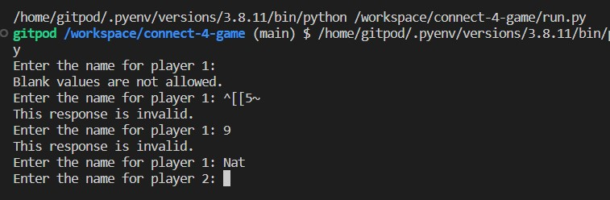
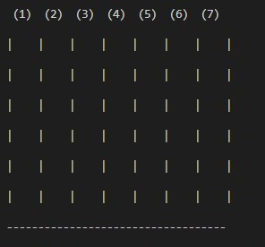
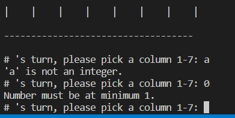

# Connect 4 Python Terminal Game

Connect 4 is a terminal based game ran through the mock terminal on Heroku.

This game is based off the popula game that is: Connect 4, where the aim of the game is to get 4 of your coloured tokens in a row , be it vertical, horizontal or diagonal.

## How To Play

This game is based on the origial game - connect 4, you can read more about it here on [Wikipedia](https://en.wikipedia.org/wiki/Connect_Four)

To play this game:

1. Enter your name at the given prompt
2. Get your opponent to add their name at the 2nd prompt
3. You will be allocated a token piece which will be what appears when you select a column
4. both players insert pieces until there is either 4 in a row or there is a tie
5. once the winner/ no winner has been decided, you will be prompted if you want to play again

## Features

### Existing Features

* Asks for user to input their name and allocates a token
* Generates an error if numbers are entered (you can add a number after the name if 2 people of the same name are playing, so it will accept nat2 for example)

* Prints out the game board at the start of a players turn

* Prints the new game board when a token has been added

* Will print errors if a number out of the grid is entered or a letter is entered

* Detects 4 in a row in all directions

### Future Features

* Use colours so players can choose a colour token instead of a character
* Have an AI player instead of the need for 2 human players
* Implement a score system

## Data Model

I decided to use a gameboard class and a player class as my model for this project. The game creates the board and will store the players move in the relevant position.

The gameboard class holds the way the game board looks (rows/ columns) and ceates the spacing between the different columns. The class also holds the user tokens and the players turns. The class also holds various methods that will print out the board to the console on each turn with the updated board that shows the previous players move. This also holds the method that the game uses to determine the winner and methods that catch various errors such as invalid moves to outside the game grid.

## Testing

* I ran the code through the Code Institutes code linter and it passed all the tests

* Warnings are produced when incorrect data is passed through user input
* Tested in Heroku and Gitpod terminal

## Bugs
### Solved Bugs

* Had an issue with the game not replaying more than once when the first round was complete. This was due to the bit of code that did that was inside the wrong function
* Found a problem where the player could input 0 or a negative number for their turn. I downloaded a library pyinputplus to be able to fix the issue

## Unsolved Bugs

* No unsolved bugs that I'm aware of.

## Deplyment

* Used the code institude code template to create my project
* created a new Heroku App
* Set the buildbacks NodeJS and Python in that order
* Linked the Heroku App to the repository
* Clicked deploy

## acknowledgements

* WikiHow for the step by step on what I needed to follow to get the game to function like the actual game - [WikiHow](https://www.wikihow.com/Play-Connect-4)
* WikiBooks for error handling - [WikiBooks](https://en.wikibooks.org/wiki/Python_Programming/Errors#:~:text=In%20python%20there%20are%20three,errors%2C%20logic%20errors%20and%20exceptions.)
* Pyinputplus to catch incorrect input instead of needing to use lots of value/ index error exceptions - [Pyinputplus](https://pypi.org/project/PyInputPlus/)
* Pwaller/ Pyfiglet for the title when the game is loaded [pyfiglet on github](https://github.com/pwaller/pyfiglet)
* My mentor Andre Aquilina for his help in finding the bugs in my code
* Code Institute for the code template that I have used for this project

